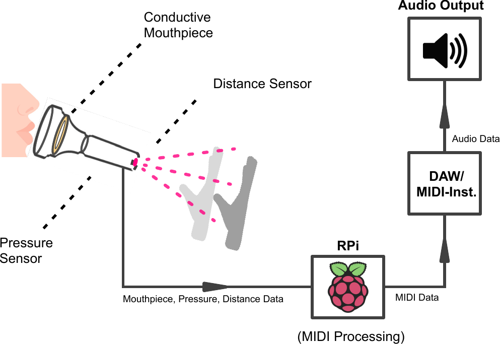

# Tromboneless


<a href="https://github.com/RyanMcB8/Tromboneless/releases" alt="Latest release">
        < /></a>


[](https://github.com/ryanmcb8/Tromboneless/issues?q=is%3Aissue+is%3Aopen+label%3A%22good+first+issue%22)

</p>





This GitHub repository contains the hardware and firmware for Tromboneless - an open source device capable of measuring oral input to synthesise the output of a brass trombone using a Raspberry Pi 5, implementing MIDI protocol. 

Tromboneless also contains its own internal synth, with custom control via the Tromboneless App!

Please refer to our Wiki [wiki](https://github.com/RyanMcB8/Tromboneless/wiki) to see component, sequence and state diagrams for the MIDI implementation.

## Table of Contents
- [Set-Up Guide](#set-up-guide)
- [Dependencies](#dependencies)
- [Bill of Materials](#bill-of-materials)
- [Social Media](#social-media)
- [Documentation](#documentation)
- [Authors & Contributions](#authors-and-contributions)

## Set-Up Guide


### Installing PiOS on Raspberry Pi 5

1. For set-up guidance for PiOS, please follow [this guide].(https://www.raspberrypi.com/documentation/computers/getting-started.html#installing-the-operating-system) <br>
   <br>

### Installing the Tromboneless Software

2. After installing PiOS on the Raspberry Pi 5, 

In the terminal or command line, run:

 ```
   git clone --recursive https://github.com/RyanMcB8/Tromboneless.git
```
   
   If this causes any errors, run:

```
   git submodule init
   git submodule update --recursive
```

*Note : Make sure git is installed on the Raspberry Pi 5.*

### Libraries

3. The Tromboneless software makes use of external libraries which are integral to the running of Tromboneless. 

These libraries include:

| Library | Purpose |
|---|---|
| [JUCE](https://juce.com/) | UI framework |
| RtMidi | Handles the communcation from USB Midi devices. |
| RPi_ads1115 | Driver for the ADC being used | 

These are included as git submodules so no extra steps need to be taken to run this script. 

### Building Tromboneless Core Tests

4. The Core directory contains all real-time processing used by the tromboneless hardware to convert raw data from hardware to a corresponding range of MIDI functions with accompanying unit test executables.     

To build just the core, run in the Core directory: 
```
cmake .
make - j4
```

### Building Tromboneless App

5. The App directory hosts a JUCE-based GUI which allows for the user to:
   - Adjust trombone slider length 
   - Adjust pressure sensitivity when interacting with mouthpiece
   - Transpose to alternative trombone ranges. 

To build the app and core, run in the Tromboneless directory:

```
cmake .
make -j1
```

*Note: Due to the computational limitations of the Pi, we recommend only using one thread to make the executable.* 


## Dependencies

6. The Tromboneless App uses the [JUCE](https://juce.com/) framework for all UI widgets.

| Library | Purpose |
|---|---|
| [JUCE](https://juce.com/) | UI framework |
| RTMidi | MIDI I/O |
| libgpiod-dev | GPIO pin interaction (Raspberry Pi) |
| pkg-config | Library detection at compile time |
| libgtk-3-dev | App backend |
| libwebkit2gtk-4.1-dev | Cross-platform support |
| libcurl4-openssl-dev | HTTP/network support |
| ALSA | Audio output for the internal synth |
| freetype2 | Font rendering |
|  build-essential | Building the project |
|  cmake-build |  Building the project |
|  libssl-dev |  Juce dependency |

To install these dependencies and build the project, there is a bash script available:
```
./makeTromboneless.sh
```

In the Tromboneless directory which will install all the necessary dependencies and then build the Tromboneless project. Once the project has been built, there will be a prompt to run the script instantly.

Alternatively, the dependencies may be installed independently using the lines below in your terminal.

```
sudo apt install libgpiod-dev pkg-config libgtk-3-dev libwebkit2gtk-4.1-dev libcurl4-openssl-dev build-essential cmake-build libssl-dev
```

## Bill of Materials

To build the Tromboneless hardware, the following materials are required:

### Computation

|   | Quantity | Cost (£) |
|------------------|----------|----------|
| Raspberry Pi 5   | 1        |     ~58.98|
| Active Cooler for Raspberry Pi 5 (recommended)  | 1        |     4.80|

### Sensors

| Sensors                                                        | Quantity | Cost (£) |
|----------------------------------------------------------------|----------|----------|
| [VL53L1X](https://shop.pimoroni.com/products/vl53l1x-breakout?variant=12628497236051) Time of Flight (ToF) Sensor Breakout                   | 1        |  16.50   |
| [CAP1188](https://thepihut.com/products/adafruit-cap1188-8-key-capacitive-touch-sensor-breakout-i2c-or-spi?variant=27739497169&country=GB&currency=GBP&utm_medium=product_sync&utm_source=google&utm_content=sag_organic&utm_campaign=sag_organic&gad_source=5&gad_campaignid=22549809780&gclid=EAIaIQobChMI_O-VrPr8kwMVHJtQBh383QmIEAQYASABEgKftPD_BwE) 8-Key Capacitive Touch Sensor Breakout                          | 1        |  7.70    |
| [ADS1115](https://shop.pimoroni.com/products/adafruit-ads1115-16-bit-adc-4-channel-with-programmable-gain-amplifier?variant=370782375) 16-bit ADC Breakout                                            | 1        |  14.70    |

Total Sensor Cost: £38.90

### Additional Components

| Additional Components                                          | Quantity | 
|----------------------------------------------------------------|----------|
| 1.0 MΩ Resistor                                               | 1        |    
| 300.0 Ω Resistor                                               | 1        |   
| USB MIDI Cable                                                 | 1        |    
| Infrared LED                                                   | 1        |    
| Photodiode                                                     | 1        |


### Assembling the circuit

Once all materials have been collected, we can now begin assembly of the Tromboneless hardware.

Click [here](Documentation/Hardware/Mouthpiece_Construction_G.md) for step-by-step hardware assembly instructions to create the mouthpiece used in Tromboneless v1.1.


## Social Media

 - **#1 Post** on [r/Trombone](https://www.reddit.com/r/Trombone/) (17-02-26) <br>

 - **#2 Post** on [r/Trombone](https://www.reddit.com/r/Trombone/comments/1s8ptlm/tromboneless_update/) (31-03-26) <br>

 - **28.6k+ total views** across [r/Embedded](https://www.reddit.com/r/embedded/comments/1sgra2m/tromboneless_update/), [r/Trombone](https://www.reddit.com/r/Trombone/comments/1r6bswo/tromboneless/) and [r/linuxaudio](https://www.reddit.com/r/linuxaudio/comments/1skgn6u/the_tromboneless/).

The social media strategy was devised to reach audiences already likely to be interested in the project, with early posts designed to spark debate and create a hype around the project.

 The three main forums targeted were:
   - [r/embedded](https://www.reddit.com/r/embedded/)
   - [r/linuxaudio](https://www.reddit.com/r/linuxaudio/)
   - [r/trombone](https://www.reddit.com/r/Trombone/)

 A comparative analysis of early Instagram and Reddit analytics led us to prioritise Reddit as the main communication channel. The forum-based structure proved better suited to fostering direct engagement with the target audience. 

 As mentioned, our posts collectively received over 28.6lk views and frequent interaction across the different targeted channels. 
 
Follow our pages linked below for Tromboneless demonstrations, updates and new development! <br>

[Reddit](https://www.reddit.com/user/Forward_Vehicle4096/)<br>
[Instagram](https://www.instagram.com/tromboneless.tech/)<br>

## Documentation
For full documentation of the Tromboneless software, refer to the [Documentation](https://github.com/RyanMcB8/Tromboneless/tree/main/Documentation) folder, which contains both LaTeX and HTML versions.

## Authors and Contributions

- **Ben Allen** - 

- **Aidan McIntosh** - 

- **Ryan McBride** - Internal synthesiser and envelope design, creation of the App side for calibration and changing of parameters in real-time and all associated test scripts. Developed the CMakeLists to create libraries to reduce repetitive compilations.

- **Kerr McLaren** - 

- **Ciaran Rogers** -  


<!-- ### ADS1115 

- ADS1115 library adopted from [Bernd Porr](https://github.com/berndporr), which can be sourced [here](https://github.com/berndporr/rpi_ads1115). -->

###


