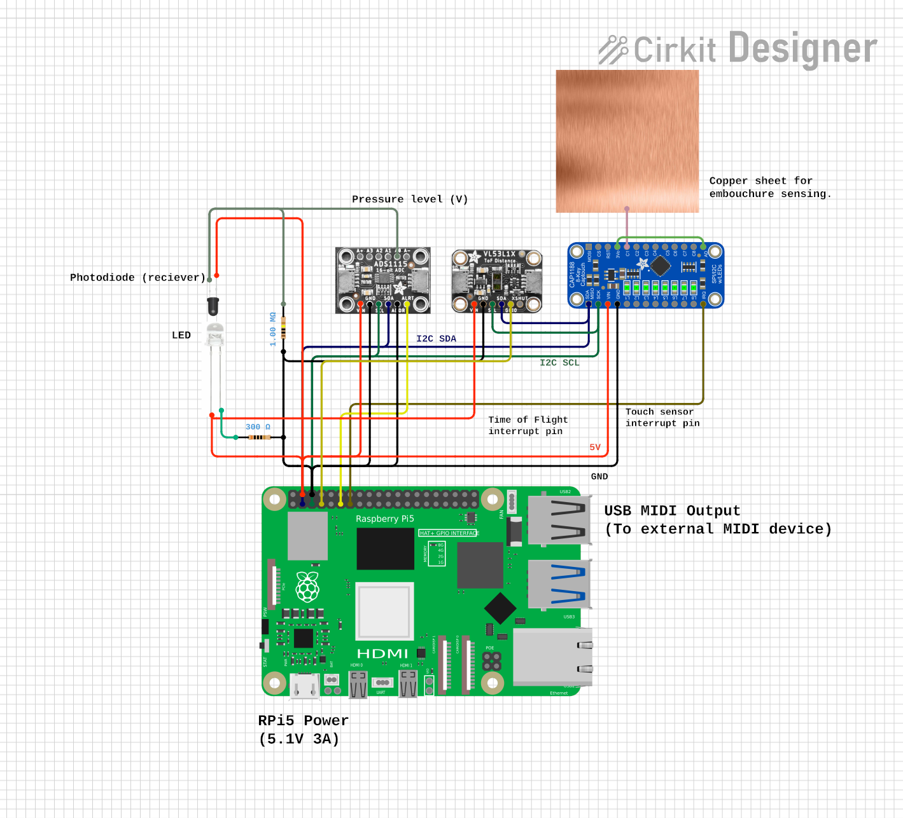
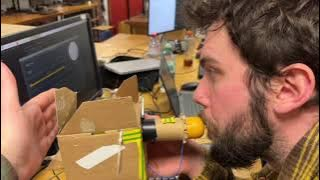

# Tromboneless


<a href="https://github.com/RyanMcB8/Tromboneless/releases" alt="Latest release">
        < /></a>


[](https://github.com/ryanmcb8/Tromboneless/issues?q=is%3Aissue+is%3Aopen+label%3A%22good+first+issue%22)

</p>


This GitHub repository contains the hardware and firmware for Tromboneless - an open source device capable of measuring oral input to synthesise the output of a brass trombone using a Raspberry Pi 5, implementing MIDI protocol. 

Tromboneless also contains its own internal synth, with custom control via the Tromboneless App!

Please refer to our [wiki](https://github.com/RyanMcB8/Tromboneless/wiki) for more information relating to components, program sequence and state diagrams for MIDI protocol implementation.

## Table of Contents
- [Set-Up Guide](#set-up-guide)
- [Dependencies](#dependencies)
- [Bill of Materials](#bill-of-materials)
- [Social Media](#social-media)
- [Documentation](#documentation)
- [Authors & Contributions](#authors-and-contributions)

## Set-Up Guide


### Installing PiOS on Raspberry Pi 5

1.  For set-up guidance for PiOS, please follow [this guide](https://www.raspberrypi.com/documentation/computers/getting-started.html#installing-the-operating-system) <br>
   <br>

### Cloning Tromboneless

2. After installing PiOS on the Raspberry Pi 5, 

   In the terminal or command line, run:

    ```
      git clone --recursive https://github.com/RyanMcB8/Tromboneless.git
   ```

**Note : Make sure git is installed on the Raspberry Pi 5.**

### Installing Libraries

3. Tromboneless software makes use of third-party libraries which are integral to the running of Tromboneless. 

| Library | Purpose |
|---|---|
| [JUCE](https://juce.com/) | UI framework |
| [RtMidi](https://github.com/thestk/rtmidi) | Handles the communication from USB Midi devices. |
| [RPi_ads1115](https://github.com/berndporr/rpi_ads1115/tree/f434fb9c197e0314af69fa5ee3839f8655fad72c) | [Bernd Porr ADC Library](https://github.com/berndporr/rpi_ads1115) used in pressure sensing. | 

    

### Installing Dependencies

4. The Tromboneless App uses the [JUCE](https://juce.com/) framework for all UI widgets, and uses the following dependencies:

| Library | Purpose | License |
|---|---|---|
| [JUCE](https://juce.com/) | UI framework | AGPLv3 / Commercial |
| RTMidi | MIDI I/O | MIT |
| libgpiod-dev | GPIO pin interaction (Raspberry Pi) | LGPLv2.1+ |
| pkg-config | Library detection at compile time | GPLv2 |
| libgtk-3-dev | App backend | LGPLv2.1+ |
| libwebkit2gtk-4.1-dev | Cross-platform support | LGPLv2.1+ |
| libcurl4-openssl-dev | HTTP/network support | MIT/curl |
| ALSA | Audio output for the internal synth | LGPLv2.1+ |
| freetype2 | Font rendering | FTL / GPLv2 |
| build-essential | Building the project | Various (GPL) |
| cmake | Building the project | BSD 3-Clause |
| libssl-dev | JUCE dependency | Apache 2.0 |

A **bash script** was created for a **single-command install** and build of all dependencies used in Tromboneless:

```
./makeTromboneless.sh
```

Running this in the ```Tromboneless``` directory will install all necessary dependencies and then build the Tromboneless project. 

Once the project has been built, there will be a prompt to run the script instantly.

Alternatively, the dependencies may be installed independently using the lines below in your terminal.

```
sudo apt install libgpiod-dev pkg-config libgtk-3-dev libwebkit2gtk-4.1-dev libcurl4-openssl-dev build-essential cmake-build libssl-dev
```

**Note: The first build of the software may require more than five minutes to complete. This is expected behaviour and will not affect subsequent runs.**

## Bill of Materials

To build the Tromboneless hardware, the following materials are required:

### Computation

|   | Quantity | Cost (£) |
|------------------|----------|----------|
| Raspberry Pi 5   | 1        |     ~58.98|
| Active Cooler for Raspberry Pi 5 (recommended)  | 1        |     4.80|

### Sensors

| Sensors                                                        | Quantity | Cost (£) |
|----------------------------------------------------------------|----------|----------|
| [VL53L1X](https://shop.pimoroni.com/products/vl53l1x-breakout?variant=12628497236051) Time of Flight (ToF) Sensor Breakout                   | 1        |  16.50   |
| [CAP1188](https://thepihut.com/products/adafruit-cap1188-8-key-capacitive-touch-sensor-breakout-i2c-or-spi) 8-Key Capacitive Touch Sensor Breakout                          | 1        |  7.70    |
| [ADS1115](https://shop.pimoroni.com/products/adafruit-ads1115-16-bit-adc-4-channel-with-programmable-gain-amplifier?variant=370782375) 16-bit ADC Breakout                                            | 1        |  14.70    |

Total Sensor Cost: £38.90

### Additional Components

| Additional Components                                          | Quantity | 
|----------------------------------------------------------------|----------|
| 1.0 M Ohm Resistor                                               | 1        |    
| 300.0 Ohm Resistor                                               | 1        |   
| USB MIDI Cable                                                 | 1        |    
| Infrared LED                                                   | 1        |    
| Photodiode                                                     | 1        |
| USB Sound Card                                                     | 1        |


### Hardware Assembly

Once all materials have been acquired, we can now begin to assemble the Tromboneless hardware.

1. Click [here](Documentation/Hardware/Mouthpiece_Construction_G.md) and follow step-by-step assembly instructions to create the mouthpiece used in the Tromboneless hardware.

2. Using the components outlined [above](#bill-of-materials), connect  the circuit andintegrate with the mouthpiece and pin headers on the Pi exactly as shown:



### Hardware-Software Integration

3. To verify sensors, install ```i2c-tools``` to confirm that sensors are being correctly recognised by the Raspberry Pi 5 i2c bus.

 ```
 sudo apt install i2c-tools
 i2cdetect -y 1
 ```

  Three devices should appear, and this confirms the correct configuration.
  
  If any do not show, check wiring and use [i2c-tools](https://www.kali.org/tools/i2c-tools/) for troubleshooting.

   4. Connect USB output of Raspberry Pi 5 to an external MIDI-compatible synthesizer, or use a USB sound card to output audio directly using the internal   synthesizer. 

5. Finally, in ```Tromboneless``` directory, run:

   ```
   ./makeTromboneless.sh
   ```
   This runs the dedicated bash [script](#installing-dependencies), and a prompt will appear to begin the program. 


   6. Use mouthpiece to trigger and change notes and distance sensor to bend notes with 7 semi-tone range. The app can be used to modify these parameters in real time.

## Social Media

 - **#1 Post** on [r/Trombone](https://www.reddit.com/r/Trombone/) (17-02-26) <br>

 - **#2 Post** on [r/Trombone](https://www.reddit.com/r/Trombone/comments/1s8ptlm/tromboneless_update/) (31-03-26) <br>

 - **28.6k+ total views** across [r/Embedded](https://www.reddit.com/r/embedded/comments/1sgra2m/tromboneless_update/), [r/Trombone](https://www.reddit.com/r/Trombone/comments/1r6bswo/tromboneless/) and [r/linuxaudio](https://www.reddit.com/r/linuxaudio/comments/1skgn6u/the_tromboneless/).

The social media strategy was devised to reach audiences already likely to be interested in the project, with the initial announcement designed to spark debate and create a hype around the project, this initial post gained over 10k views and was the #1 post on r/Trombone that day.

 Using this model, three main forums targeted were:
   - [r/embedded](https://www.reddit.com/r/embedded/)
   - [r/linuxaudio](https://www.reddit.com/r/linuxaudio/)
   - [r/trombone](https://www.reddit.com/r/Trombone/)

 A comparative analysis of early Instagram and Reddit analytics led us to prioritise Reddit as the main communication channel. The forum-based structure proved better suited to fostering direct engagement with the target audience. 

 As mentioned, our posts collectively received over 28.6lk views and frequent interaction across the different targeted channels throughout the project, as can be seen [here](https://www.reddit.com/user/Forward_Vehicle4096/). 
 
Follow our pages linked below for Tromboneless demonstrations, updates and new development! <br>

[Reddit](https://www.reddit.com/user/Forward_Vehicle4096/)<br>
[Instagram](https://www.instagram.com/tromboneless.tech/)<br>

and check out our **Tromboneless v1.0.0 release video**: 

**Click the image below!**

[](https://youtu.be/Kp4s3FqIstI)


## Documentation

For full documentation of the Tromboneless software, refer to the [Documentation](https://github.com/RyanMcB8/Tromboneless/tree/main/Documentation) folder, which contains both LaTeX and HTML versions.

### Datasheets

All datasheets for components used can be located [here](Documentation/Hardware/datasheets).

## Authors and Contributions

- **Ben Allen** - Driver for the CAP1188 capacitive sensor, sensor data processing, Arduino prototyping, hardware design and construction, PCB design, and Tromboneless player.

- **Aidan McIntosh** - High-level event-handling, musical coordination, external MIDI integration

- **Ryan McBride** - Internal synthesiser and envelope design, creation of the App side for calibration and changing of parameters in real-time and all associated test scripts. Developed the CMakeLists to create libraries to reduce repetitive compilations.

- **Kerr McLaren** - ToF 'Slide' sensor integration and I2C communication set-up. 

- **Ciaran Rogers** - ADS1115 Pressure-sensor wrapper, initial CMake and JUCE App bring-up, audioRender integration, Documentation, Social Media/PR Strategy.


<!-- ### ADS1115 

- ADS1115 library adopted from [Bernd Porr](https://github.com/berndporr), which can be sourced [here](https://github.com/berndporr/rpi_ads1115). -->


